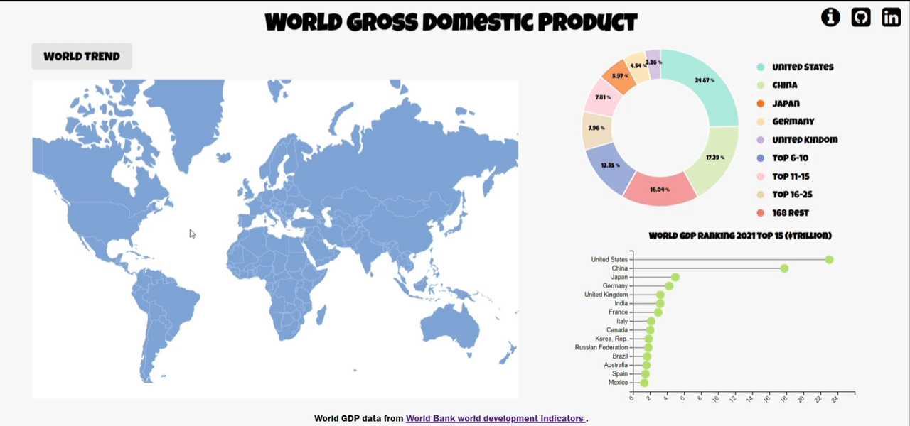
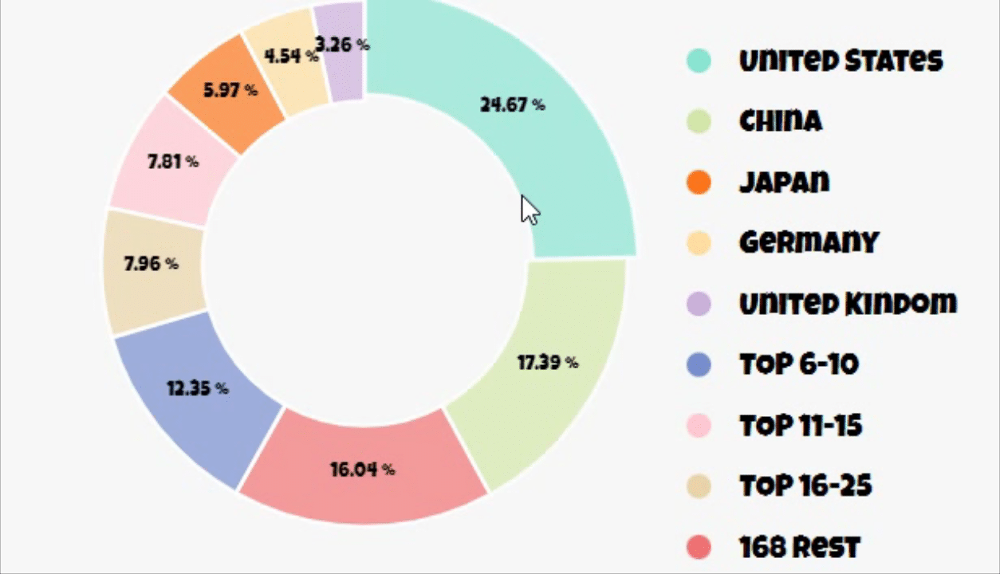
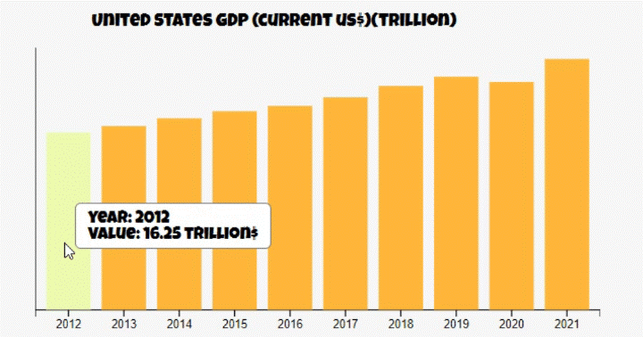
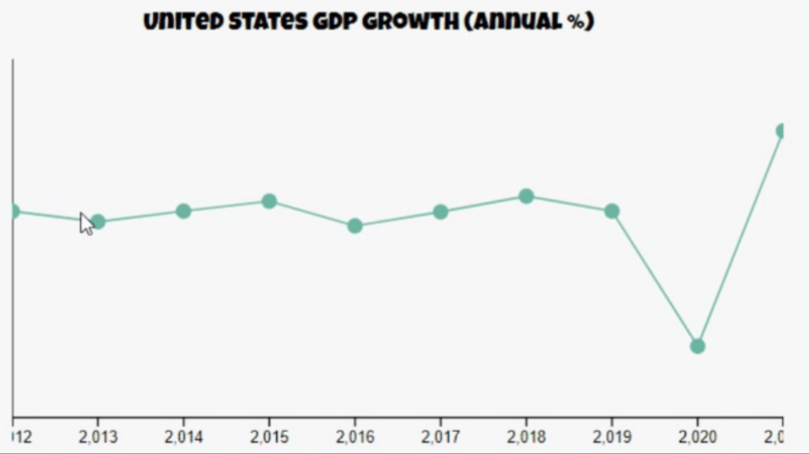
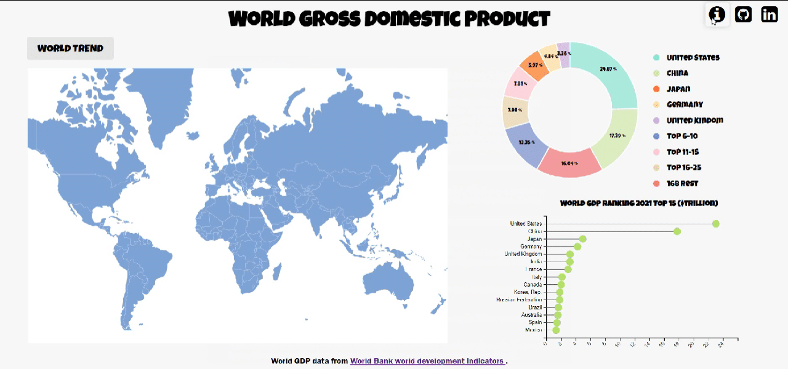

## world_gdp
# Background
Gross domestic product (GDP) is a monetary measure of the market value of all the final goods and services produced in a specific time period by countries. GDP is often used as a metric for international comparisons as well as a broad measure of economic progress. It is often considered to be the "world's most powerful statistical indicator of national development and progress".

[World GDP Visualizer](https://shuyangn.github.io/world_gdp_visualization/) is a tool used to help users visualize the GDP of all the countries in the world. It can intuitively display the changes in GDP and growth trend of each country in the past decade, and help users quickly get the information of the economic trend of that country. Users can also see the proportion of some countries in the world's total GDP.

# Funtionality & MVPs

# Technologies, Libraries, APIs

* Javascript
* HTML5/CSS
* D3.js
* D3 Geo
* [World Bank World Development Indicator API](https://api.worldbank.org/v2/country/chn/indicator/)
