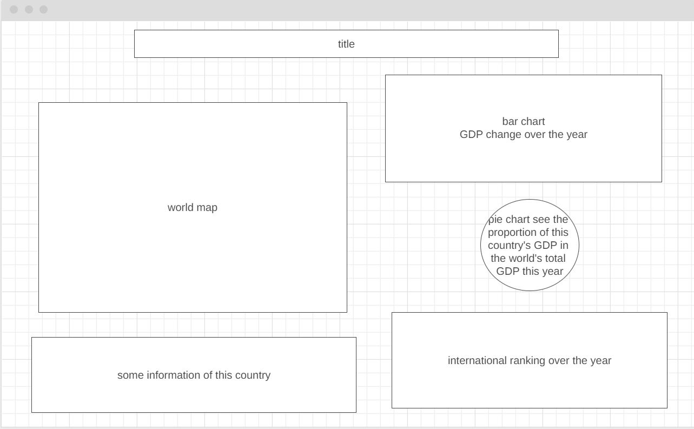

## js_project
# Background
Gross domestic product (GDP) is a monetary measure of the market value of all the final goods and services produced in a specific time period by countries. GDP is often used as a metric for international comparisons as well as a broad measure of economic progress. It is often considered to be the "world's most powerful statistical indicator of national development and progress".

This project is a data visualization demo that shows the pattern of each country's GDP calculated on an annual basis. Users can select different country to see the changes and distribution over the year.

# Funtionality & MVPs
1. Users will be able to select different countries and years on the map.
2. Users will be able to see the GDP changes of the whole world.
3. Users can get some charts of a country's GDP over years or percentage in world.

# Wireframes

# Technologies, Libraries, APIs

Javascript, HTML/CSS, d3.js

# Implementation Timeline
Day 1/2: Basic functionalities (DOM)
Day 3: insert API
Day 4: handle API
Day 5: process style